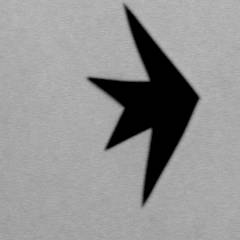
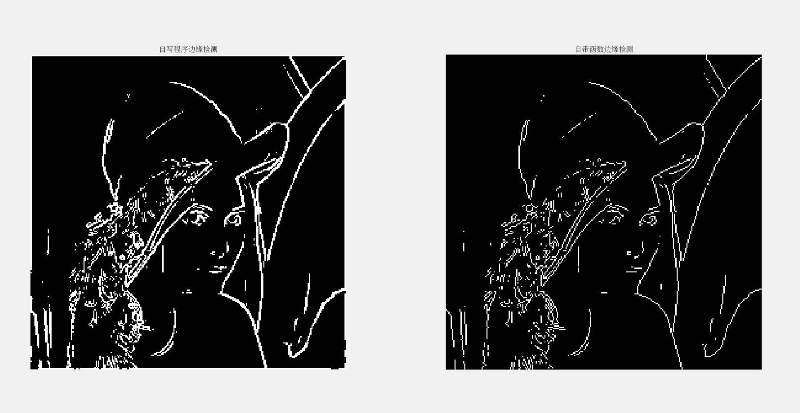
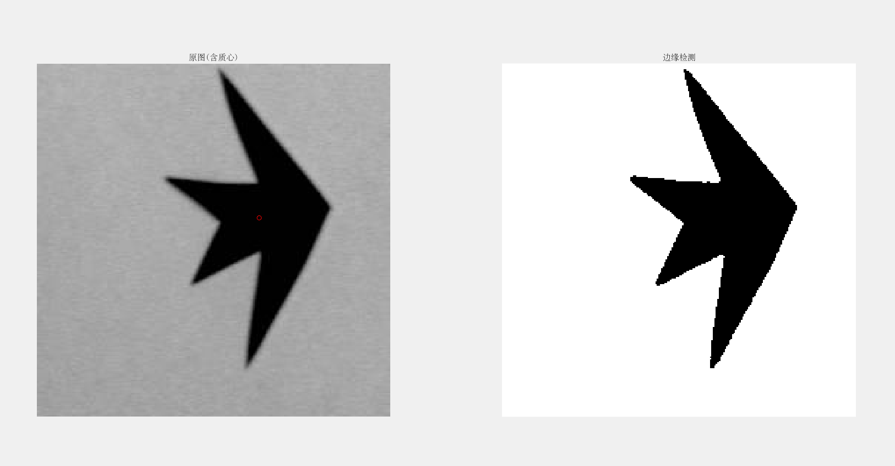

# 实验三、图像分割及目标检测

### 一、实验目的

1. 了解图像边缘检测及图像区域分割的目的、意义和手段。
2. 熟悉各种经典的边缘检测算子、图像分割方法及其基本原理。
3. 熟悉各种图像特征表示与描述的方法及基本原理。
4. 熟练掌握利用MATLAB 工具实现各种边缘检测的代码实现。
5. 熟练掌握利用MATLAB 工具实现基本阈值分割的代码实现。
6. 通过编程和仿真实验，进一步理解图像边缘检测、图像分割及其在目标检测、目标识别及跟踪测量应用中的重要性。

### 二、实验内容及原理

#### 1、利用Sobel算子进行图像的边缘检测

（1）实验原理与步骤
数字图像的边缘一般利用一阶/二阶差分算子进行检测。常用的差分算子包括：Roberts 算子（对角算子），Prewitt 算子（一阶），Sobel 算子（一阶），Laplacian 算子（二阶），LoG 算子（二阶）及Canny 边缘检测算法等。其中，Sobel 算子为常见的一类梯度算子（一阶梯度算子）。其x, y 方向的梯度算子分别为：
$$S_x=
\begin{bmatrix}
-1 & 0 & 1 \\
-2 & 0 & 2 \\
-1 & 0 & 1
\end{bmatrix},
S_y=
\begin{bmatrix}
-1 & -2 & -1 \\
0 & 0 & 0 \\
1 & 2 & 1
\end{bmatrix}$$
如图 1 所示，一幅数字图像I 与Sx 和Sy 分别做滤波（相关）运算后（可选用多种方式，如`conv2`，`filter2` 及`imfilter` 等MATLAB 函数），可以求得x, y 两个方向的梯度图像Dx, Dy，然后，可以计算得到原图像的梯度幅度，即
$$D = \sqrt{Dx^2+Dy^2}$$

（2）进一步执行梯度图像D 的二值化处理（建议采用Otsu 阈值，也可考虑其他阈值分割），检测图像的二值化边缘。

（3）对于与步骤同样的输入图像I，利用MATLAB 工具的`edge(I,’sobel’)`函数进行处理。试比较处理结果与步骤（2）的得到的结果的差异，并分析检测结果存在一定差异的原因。

（4）画出原图像、原图像的Dx，Dy，D 图，及最终的边缘检测结果图（即二值化边缘）。


#### 2、数字图像中目标区域测量及计算

实验原理、内容及步骤如下：

① 对图 2 中的黑色形状目标进行阈值分割，得到二值化的图像；



② 计算目标形状的面积（以像素单位表示）；

③ 计算图中黑色形状目标的形心位置，并在原图上进行位置标记（可以计算位置为圆心，以一定半径r画一个红色小圆圈）。
$$\begin{cases}
x_c = \frac{1}{A}\sum_{y = 0}^{N - 1}\sum_{x = 0}^{M-1}xf(x,y) \\
y_c = \frac{1}{A}\sum_{y = 0}^{N - 1}\sum_{x = 0}^{M-1}yf(x,y)
\end{cases}$$
其中，A为目标区域面积，f(x,y)在背景区域值为0，目标区域值为1。

### 三、源代码及实验结果

#### 第一题

```matlab
clear; close all; clc;
%读取图像
image = im2double(rgb2gray(imread('lena256.jpg')));
[M, N] = size(image);
sobel_x = [-1, 0, 1; -2, 0, 2; -1, 0, 1];
sobel_y = [-1, -2, -1; 0, 0, 0; 1, 2, 1];
%边缘检测
image_sobel_x = imfilter(image, sobel_x, 'conv', 0, 'same');
image_sobel_y = imfilter(image, sobel_y, 'conv', 0, 'same');
image_sobel = sqrt(image_sobel_x.^2 + image_sobel_y.^2);
figure(1);
subplot(2, 2, 1); imshow(image); title('原图像');
subplot(2, 2, 2); imshow(image_sobel_x); title('X方向梯度');
subplot(2, 2, 3); imshow(image_sobel_y); title('Y方向梯度');
subplot(2, 2, 4); imshow(image_sobel); title('边缘检测结果');
% 二值化图像，取阈值为0.9；
% level = graythresh(image);
% image_sobel_binary = imbinarize(image_sobel, level);
image_sobel_binary = zeros(M, N); level = 0.9;
for i = 1:M
  for j = 1:N
    if image_sobel(i, j) > level
      image_sobel_binary(i, j) = 1;
    else
      image_sobel_binary(i, j) = 0;
    end
  end
end
matlab_image_sobel = edge(image, 'sobel');

figure(2);
subplot(1, 2, 1); imshow(image_sobel_binary); title('自写程序边缘检测');
subplot(1, 2, 2); imshow(matlab_image_sobel); title('自带函数边缘检测');
```




#### 第二题

```matlab
clear; close all; clc;
%读取图像　取阈值为0.5
image = im2double(imread('starshape.jpg'));
[M, N] = size(image);
level = 0.5;
image_binary = imbinarize(image, level);
size_image_binary = M*N - sum(sum(image_binary));
% 计算质心的位置　并画出质心
circle_x = 0; circle_y = 0;
for i = 1:M
  for j = 1:N
    circle_x = circle_x + i*(1 - image_binary(i, j));
    circle_y = circle_y + j*(1 - image_binary(i, j));
  end
end
circle_x = circle_x/size_image_binary; circle_y = circle_y/size_image_binary;
subplot(1, 2, 1); imshow(image); hold on; plot(circle_y, circle_x, 'ro'); title('原图(含质心)');
subplot(1, 2, 2); imshow(image_binary); title('边缘检测');
```


**目标形状的面积为7846**

### 四、思考题

1. 利用梯度算子与图像进行滤波（相关）运算后，为什么还需要给定阈值进行二值化处理？
答：滤波运算过后得到的只是图像像素灰度变换的梯度图，经过二值化处理才能得到有用的边界信息。
2. Laplacian算子检测边缘为什么会产生双边效果？为什么不能检测出边的方向。
答：Laplacian算子是对图像求二阶导数，二阶导数在灰度斜坡和灰度台阶过渡处产生双边效应。
3. 相对其他边缘检测算子，Canny边缘检测算法的主要优势体现在哪里？
答：失误率低；位置精度高；对每个边缘有唯一的响应。
