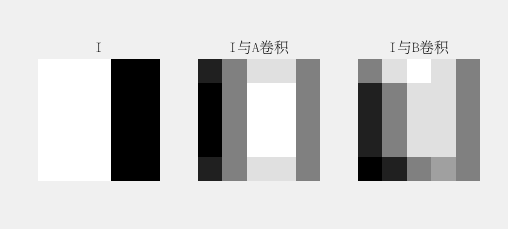
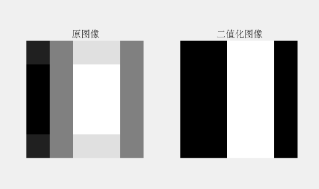
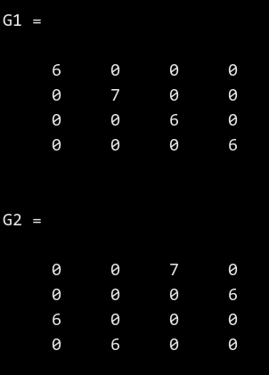
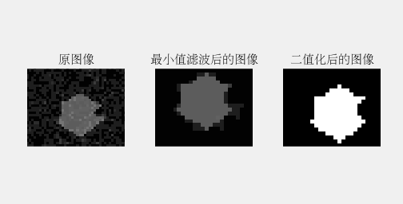

## 第七章作业

#### 第一题

> 试分别计算I与A和B两个模板的滤波结果，输出结果要求与I的维数相同，需要考虑边界处理问题（边界填充0值）。并说明A与B两个模板对处理结果有什么不同响应？
> $I=
\begin{bmatrix}
1 & 1 & 1 & 0 & 0 \\
1 & 1 & 1 & 0 & 0 \\
1 & 1 & 1 & 0 & 0 \\
1 & 1 & 1 & 0 & 0 \\
1 & 1 & 1 & 0 & 0 \\
\end{bmatrix}$ $A=
\begin{bmatrix}
-1 & 0 & 1 \\
-2 & 0 & 2 \\
-1 & 0 & 1
\end{bmatrix}$ $B=
\begin{bmatrix}
0 & 1 & 2 \\
-1 & 0 & 1 \\
-2 & -1 & 0
\end{bmatrix}$

源代码

```matlab
clc,clear,close all;

I = [1, 1, 1, 0, 0; 1, 1, 1, 0, 0; 1, 1, 1, 0, 0; 1, 1, 1, 0, 0; 1, 1, 1, 0, 0];
A = [-1, 0, 1; -2, 0, 2; -1, 0, 1];
B = [0, 1, 2; -1, 0, 1; -2, -1, 0];
I_A = imfilter(I, A, 'conv', 0, 'same');
I_B = imfilter(I, B, 'conv', 0, 'same');
subplot(1, 3, 1); imshow(I, []); title('I');
subplot(1, 3, 2); imshow(I_A, []); title('I与A卷积');
subplot(1, 3, 3); imshow(I_B, []); title('I与B卷积');
```

运行结果



#### 第二题

> 利用阈值分割方法（自选阈值化方法），对第一题的模板A的滤波结果，进行阈值分割，求最后的二值(0,1)图像，即边缘检测图。

源代码

```matlab
clc; clear; close all;

I_A = [-3, 0, 3, 3, 0; -4, 0, 4, 4, 0; -4, 0, 4, 4, 0; -4, 0, 4, 4, 0; -3, 0, 3, 3, 0];
[M, N] = size(I_A);
level = 2;
I_A_binary = zeros(M, N);
for i = 1:M
  for j = 1:N
    if I_A(i, j) > level
      I_A_binary(i, j) = 1;
    else
      I_A_binary(i, j) = 0;
    end
  end
end
subplot(1, 2, 1); imshow(I_A, []); title('原图像');
subplot(1, 2, 2); imshow(I_A_binary, []); title('二值化图像');
```

运行结果



#### 第三题

> 已知如下图像A，参考给出的坐标系求其`d=(dx=1,dy=-1)`方向矢量控制下的灰度共生矩阵 $G_1$ 。
> $$A=
\begin{bmatrix}
0 & 1 & 2 & 3 & 0 & 1 \\
1 & 2 & 3 & 0 & 1 & 2 \\
2 & 3 & 0 & 1 & 2 & 3 \\
3 & 0 & 1 & 2 & 3 & 0 \\
0 & 1 & 2 & 3 & 0 & 1 \\
1 & 2 & 3 & 0 & 1 & 2
\end{bmatrix}$$
> 如仅考虑对称性，不考虑坐标方向，其共生矩阵 $G_2$ 为多少？

源代码

```matlab
clc; clear; close all;

A = [0, 1, 2, 3, 0, 1; 1, 2, 3, 0, 1, 2; 2, 3, 0, 1, 2, 3; 3, 0, 1, 2, 3, 0; 0, 1, 2, 3, 0, 1; 1, 2, 3, 0, 1, 2];
[M, N] = size(A);
L = 4;
G1 = zeros(L, L); G2 = zeros(L, L);
%　灰度共生矩阵G1
for x = 1:M - 1
  for y = 2:N
    G1(A(x, y) + 1, A(x + 1, y - 1) + 1) = G1(A(x, y) + 1, A(x + 1, y - 1) + 1) + 1;
  end
end
%　灰度共生矩阵G2
for x = 1:M - 1
  for y = 1:N - 1
    G2(A(x, y) + 1, A(x + 1, y + 1) + 1) = G2(A(x, y) + 1, A(x + 1, y + 1) + 1) + 1;
  end
end
```

运行结果



#### 第四题

> 利用本章及以前章节所学知识，对含噪图像中的目标进行（区域）分割，并显示处理结果。

源代码

```matlab
clear; close all; clc;
% 读取图像
image = im2double(imread('homework4.jpg'));
[M, N] = size(image);
% 对图像进行最小值滤波
image_min = zeros(M, N);
s1 = zeros(1,9);
for i = 2:M-1
  for j = 2:N-1
    count = 0;
    for k = i - 1:i + 1
      for p = j - 1:j + 1
        count = count + 1;
        s1(count) = image(k, p);
      end
    end
    image_min(i, j) = min(s1);
  end
end
% 对图像二值化　取阈值为0.２
level = 0.2;
image_min_binary = zeros(M, N);
for i = 1:M
  for j = 1:N
    if image_min(i, j) > level
      image_min_binary(i, j) = 1;
    else
      image_min_binary(i, j) = 0;
    end
  end
end
subplot(1, 3, 1); imshow(image); title('原图像');
subplot(1, 3, 2); imshow(image_min); title('最小值滤波后的图像');
subplot(1, 3, 3); imshow(image_min_binary); title('二值化后的图像');
```

运行结果


