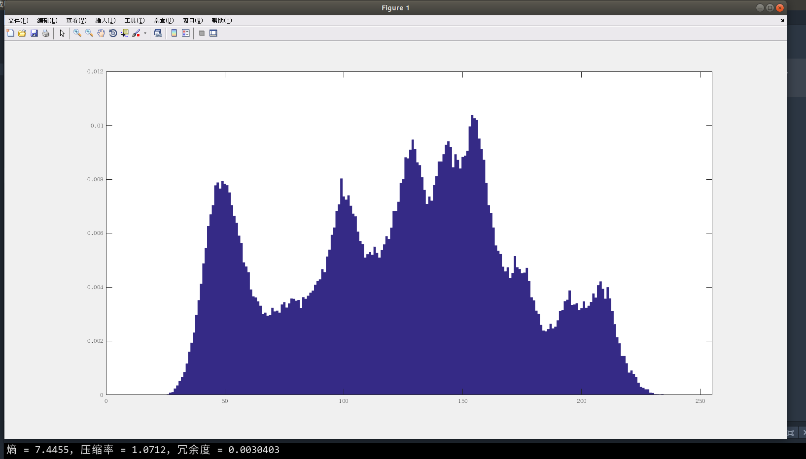

# 第六章作业

## 第一题

> 已知符号A，E，I，O，U，V其出现的概率分别是0.1,0.4,0.06,0.1,0.04,0.3，对其进行霍夫曼编码，给出码字、码字的平均长度和编码效率。

* 码字
    * E = 0
    * V = 11
    * A = 100
    * O = 1011
    * I = 10101
    * U = 10100
* 平均码长 `L = 0.1*3 + 0.4*1 + 0.06*5 + 0.1*4 + 0.04*5 + 0.3*2 = 2.2`
* 编码效率 `η = H(S)/L = 2.14/2.2 = 97.3%`

## 第二题

> 考虑如下大小为4*8的图像：
> 21 21 95 95 169 169 243 243
> 21 21 95 95 169 169 243 243
> 21 21 95 95 169 169 243 243
> 21 21 95 95 169 169 243 243
> 1. 计算该图像的熵；
> 2. 用霍夫曼压缩该图像；
> 3. 计算用霍夫曼编码能达到的压缩率和效率。

1. `H(S) = -4*0.25*log2(0.25) = 2`
2. * 01 01 00 00 11 11 10 10
   * 01 01 00 00 11 11 10 10
   * 01 01 00 00 11 11 10 10
   * 01 01 00 00 11 11 10 10
3. 压缩率 `C = 8/2 = 4` 效率 `η = H(s)/L = 2/2 =100%`

## 第三题

> 编程练习：读取一幅512\*512\*8比特的单色Lena图像，完成以下步骤：
> 1. 统计该图像的概率直方图，并画出直方图；
> 2. 计算该图像的熵；
> 3. 对其进行霍夫曼编码；
> 4. 分别计算压缩率和冗余度。

#### 代码
```matlab
close all; clear; clc;
%读取图像
image = imread('lena512.bmp');
I = image(:);
image = double(image);
[M, N] = size(image);
%统计图像的概率直方图
probability = zeros(1,256);
for i = 1:M
  for j = 1:N
    probability(image(i, j) + 1) = probability(image(i, j) + 1) + 1;
  end
end
probability = probability./(M*N);
x = 0:255;
bar(x,probability(x + 1),1); xlim([0, 255]);
%计算图像的熵(entropy)
entropy = 0;
for i = 1:256
  if probability(i) ~= 0
    entropy = entropy - probability(i)*log2(probability(i));
  end
end
%进行霍夫曼编码
dict = huffmandict(x,probability); %生成字典
enco = huffmanenco(I,dict); %编码
[p, q] = size(enco);
average_code_lenth = p/(M*N);
%计算压缩率(compression ratio)和冗余度(redundancy)
compression_ratio = 8/average_code_lenth;
redundancy = 1-(entropy/average_code_lenth);
disp(['熵 = ', num2str(entropy), '，压缩率 = ', num2str(compression_ratio), '，冗余度 = ', num2str(redundancy)])
```
#### 运行结果

