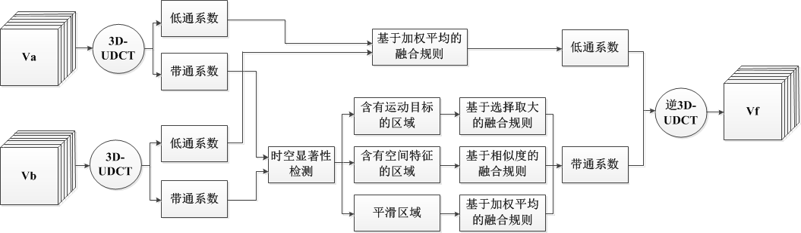

<!--  -->

# 基于时空结构张量的视频融合(Multisensor video fusion based on spatial-temporal salience detection)

基于时空结构张量的视频融合算法流程图

## 均匀离散曲波变换

对原输入视频$V_a$和$V_b$进行3D-UDCT分解，得到对应的子带系数 $\{C_{V_a}^{(J+1)}(x,y,t),C_{V_a}^{(j,l_1,l_2,l_3)}(x,y,t)\}$ 和 $\{C_{V_b}^{(J+1)}(x,y,t),C_{V_b}^{(j,l_1,l_2,l_3)}(x,y,t)\}$ ，其中 $C_{V_a/V_b}^{(J+1)}(x,y,t)$ 代表最粗尺度层的低频子带系数，$C_{V_a/V_b}^{(j,l_1,l_2,l_3)}(x,y,t)$ 代表第 $j(j=1,2,…,J)$ 阶，方向 $(l_1,l_2,l_3)$ 上的带通方向子带系数。

## 时空显著性检测

#### 结构张量

假设 $p(x,y,t)$ 是视频 $V$ 上的一个点，则它的结构张量(structure tensor)可以表示为下式 $S(x,y,t)$ ：
$$S(x,y,t)=\begin{bmatrix}
\sum_{k\in\Omega}\omega(r)V_x^2(p-r) & \sum_{k\in\Omega}\omega(t)V_x(p-r)V_y(p-r) & \sum_{k\in\Omega}\omega(t)V_x(p-r)V_t(p-r) \\
\sum_{k\in\Omega}\omega(t)V_x(p-r)V_y(p-r) & \sum_{k\in\Omega}\omega(t)V_y^2(p-r) & \sum_{k\in\Omega}\omega(t)V_y(p-r)V_t(p-r) \\
\sum_{k\in\Omega}\omega(t)V_x(p-r)V_t(p-r) & \sum_{k\in\Omega}\omega(t)V_y(p-r)V_t(p-r) & \sum_{k\in\Omega}\omega(t)V_t^2(p-r)
\end{bmatrix}$$
其中 $\Omega$ 表示以点 $p(x,y,z)$ 为中心的大小为 $M_1\times {N_1\times T_1}$ 的区域，$\omega(r)$ 是一个大小同样为 $M_1\times {N_1\times T_1}$ 的高斯模板，$V_x(p),V_y(p),V_t(p)$ 分别是视频 $V$ 对 $x,y,t$ 三个分量的偏导数。

#### 带通系数分解

根据结构张量矩阵的秩 $\Re(x,y,t)$ 的不同可以将带通系数分为三个部分。
$$p(x,y,t)\in
\begin{cases}
R_M, & \Gamma(x,y,t)<th1(t) \\
R_S, & \Gamma(x,y,t)\ge th1(t)\And |\varepsilon_3(x,y,t)|<th2(t) \\
R_T, & \Gamma(x,y,t)\ge th1(t)\And|\varepsilon_3(x,y,t)|\ge th2(t)
\end{cases}$$
$$th1(t)=k_1\times\max_{x,y}(\Gamma(x,y,t))$$
$$th2(t)=k_2\times\max_{x,y}(|\varepsilon_3(x,y,t)|)$$
其中 $R_M,R_S,R_T$ 分别代表平滑区域，含有空间特征的区域和含有运动目标的区域；$\Gamma(x,y,t)$ 表示矩阵 $S(x,y,t)$ 的迹；$k_1,k_2$ 为参数；$\varepsilon_3(x,y,t)$ （特征向量 $\varepsilon(x,y,t)=(\varepsilon_1(x,y,t),\varepsilon_2(x,y,t),\varepsilon_3(x,y,t))^T$ ）对应矩阵 $S(x,y,t)$ 的最大特征值。

#### 视频融合算法

##### 带通系数

* 含运动目标的区域：$R_T^{(j,l_1,l_2,l_3)}=R_{T,V_a}^{(j,l_1,l_2,l_3)}|R_{T,V_b}^{(j,l_1,l_2,l_3)}$;
* 含空间特征的区域：$R_S^{(j,l_1,l_2,l_3)}=(R_{S,V_a}^{(j,l_1,l_2,l_3)}|R_{S,V_b}^{(j,l_1,l_2,l_3)})\And \overline{R_T^{(j,l_1,l_2,l_3)}}$;
* 平滑区域：$R_M^{(j,l_1,l_2,l_3)}=R_{M,V_a}^{(j,l_1,l_2,l_3)}\And R_{M,V_b}^{(j,l_1,l_2,l_3)}$.

###### 含运动目标的区域

采用选择取大的融合规则得到对应的系数：
$$C_{V_f}^{(j,l_1,l_2,l_3)}(x,y,t)=
\begin{cases}
C_{V_a}^{(j,l_1,l_2,l_3)}(x,y,t), & E_{V_a}^{(j,l_1,l_2,l_3)}(x,y,t)>E_{V_b}^{(j,l_1,l_2,l_3)}(x,y,t)\\
C_{V_b}^{(j,l_1,l_2,l_3)}(x,y,t), & E_{V_a}^{(j,l_1,l_2,l_3)}(x,y,t)\le E_{V_b}^{(j,l_1,l_2,l_3)}(x,y,t)
\end{cases}$$
其中 $E_{V_a/V_b}^{(j,l_1,l_2,l_3)}(x,y,t)$ 表示以点 $(x,y,t)$ 为中心、大小为 $M_2\times {N_2\times T_2}$ 的区域的能量：
$$E_{V_a/V_b}^{(j,l_1,l_2,l_3)}(x,y,t)= \sum_{m=-(M_2-1)/2}^{(M_2-1)/2}\sum_{n=-(N_2-1)/2}^{(N_2-1)/2}\sum_{\tau=-(T_2-1)/2}^{(T_2-1)/2}g(m,n,\tau)|C_{V_a/V_b}^{(j,l_1,l_2,l_3)}(x+m,y+n,t+\tau)|^2$$
其中 $g(m,n,\tau)$ 是大小为 $M_2\times{N_2\times T_2}$ 的高斯模板。

###### 含空间特征的区域

采用基于相似度的融合规则对其进行融合
首先，计算出 $C_{V_a}^{(j,l_1,l_2,l_3)}$ 和 $C_{V_b}^{(j,l_1,l_2,l_3)}$ 之间的时空能量匹配指数 $\gamma_{V_{ab}}^{(j,l_1,l_2,l_3)}$ ：
$$\gamma_{V_{ab}}^{(j,l_1,l_2,l_3)}(x,y,t)=\frac{2\sum_{m=-(M_2-1)/2}^{(M_2-1)/2}\sum_{n=-(N_2-1)/2}^{(N_2-1)/2}\sum_{\tau=-(T_2-1)/2}^{(T_2-1)/2}|C_{V_a}^{(j,l_1,l_2,l_3)}(x+m,y+n,t+\tau)C_{V_a}^{(j,l_1,l_2,l_3)}(x+m,y+n,t+\tau)|}{\sum_{m=-(M_2-1)/2}^{(M_2-1)/2}\sum_{n=-(N_2-1)/2}^{(N_2-1)/2}\sum_{\tau=-(T_2-1)/2}^{(T_2-1)/2}|C_{V_a}^{(j,l_1,l_2,l_3)}(x+m,y+n,t+\tau)|^2+\sum_{m=-(M_2-1)/2}^{(M_2-1)/2}\sum_{n=-(N_2-1)/2}^{(N_2-1)/2}\sum_{\tau=-(T_2-1)/2}^{(T_2-1)/2}|C_{V_b}^{(j,l_1,l_2,l_3)}(x+m,y+n,t+\tau)|^2}$$
然后对每个子带定义如下的自适应阈值：
$$\alpha^{(j,l_1,l_2,l_3)}=0.5\times\max_{(x,y,t)}(\gamma_{V_{ab}}^{(j,l_1,l_2,l_3)}(x,y,t))$$
如果 $\gamma_{V_{ab}}^{(j,l_1,l_2,l_3)}(x,y,t)\le\alpha^{(j,l_1,l_2,l_3)}$ ，则输入视频 $V_a$ 和 $V_b$ 当前区域的空间特征之间被认为是互补的，用选择取大的方法来得到融合系数：
$$C_{V_f}^{(j,l_1,l_2,l_3)}(x,y,t)=
\begin{cases}
C_{V_a}^{(j,l_1,l_2,l_3)}(x,y,t), & \delta_{V_a}^{(j,l_1,l_2,l_3)}(x,y,t)>\delta_{V_b}^{(j,l_1,l_2,l_3)}(x,y,t) \\
C_{V_b}^{(j,l_1,l_2,l_3)}(x,y,t), & \delta_{V_a}^{(j,l_1,l_2,l_3)}(x,y,t)\le\delta_{V_b}^{(j,l_1,l_2,l_3)}(x,y,t) \\
\end{cases}$$
如果 $\gamma_{V_{ab}}^{(j,l_1,l_2,l_3)}(x,y,t)>\alpha^{(j,l_1,l_2,l_3)}$ 则输入视频 $V_a$ 和 $V_b$ ，当前区域的空间特征之间被认为是冗余的，用加权平均的方法来得到融合系数：
$$C_{V_f}^{(j,l_1,l_2,l_3)}(x,y,t)=\omega_{V_a}^{(j,l_1,l_2,l_3)}(x,y,t)C_{V_a}^{(j,l_1,l_2,l_3)}(x,y,t)+\omega_{V_b}^{(j,l_1,l_2,l_3)}(x,y,t)C_{V_b}^{(j,l_1,l_2,l_3)}(x,y,t)$$
其中的显著性检测 $\delta_{V_a/V_b}^{(j,l_1,l_2,l_3)}(x,y,t)$ 由下式得到：
$$\delta_{V_a/V_b}^{(j,l_1,l_2,l_3)}(x,y,t)=E_{V_a/V_b}^{(j,l_1,l_2,l_3)}(x,y,t)\lambda_{V_a/V_b}^{j,l_1,l_2,l_3}(x,y,t)$$
$\lambda_{V_a/V_b}^{(j,l_1,l_2,l_3)}(x,y,t)$ 代表当前位置结构张量矩阵的最大特征值。

其中的权系数 $\omega_{V_a/V_b}^{(j,l_1,l_2,l_3)}$ 由下面的式子得出：
$$\omega_{V_a}^{(j,l_1,l_2,l_3)}(x,y,t)=\frac{\delta_{V_a}^{(j,l_1,l_2,l_3)}(x,y,t)}{\delta_{V_a}^{(j,l_1,l_2,l_3)}(x,y,t)+\delta_{V_b}^{(j,l_1,l_2,l_3)}(x,y,t)}$$
$$\omega_{V_b}^{(j,l_1,l_2,l_3)}(x,y,t)=\frac{\delta_{V_b}^{(j,l_1,l_2,l_3)}(x,y,t)}{\delta_{V_a}^{(j,l_1,l_2,l_3)}(x,y,t)+\delta_{V_b}^{(j,l_1,l_2,l_3)}(x,y,t)}$$

###### 平滑区域

采用加权平均的融合规则得到子带系数：
$$C_{V_f}^{(j,l_1,l_2,l_3)}(x,y,t)=\omega_{V_a}^{(j,l_1,l_2,l_3)}(x,y,t)C_{V_a}^{(j,l_1,l_2,l_3)}(x,y,t)+\omega_{V_b}^{(j,l_1,l_2,l_3)}(x,y,t)C_{V_b}^{(j,l_1,l_2,l_3)}(x,y,t)$$
上式中的加权系数 $\omega_{V_a/V_b}^{(j,l_1,l_2,l_3)}(x,y,t)$ 与之前的权系数有所不同：
$$\omega_{V_a}^{(j,l_1,l_2,l_3)}(x,y,t)=\frac{E_{V_a}^{(j,l_1,l_2,l_3)}(x,y,t)}{E_{V_a}^{(j,l_1,l_2,l_3)}(x,y,t)+E_{V_b}^{(j,l_1,l_2,l_3)}(x,y,t)}$$
$$\omega_{V_b}^{(j,l_1,l_2,l_3)}(x,y,t)=\frac{E_{V_b}^{(j,l_1,l_2,l_3)}(x,y,t)}{E_{V_a}^{(j,l_1,l_2,l_3)}(x,y,t)+E_{V_b}^{(j,l_1,l_2,l_3)}(x,y,t)}$$
**最后将上述步骤中区域 $R_T^{(j,l_1,l_2,l_3)}$ ，区域 $R_S^{(j,l_1,l_2,l_3)}$ 和区域 $R_M^{(j,l_1,l_2,l_3)}$ 计算得到的带通方向子带系数相加，得到融合后的带通方向子带系数 $C_{V_f}^{(j,l_1,l_2,l_3)}$ 。**

##### 低通系数

对于低通系数，采用加权平均的融合规则，和带通系数的平滑区域融合一样：
$$C_{V_f}^{(J+1)}(x,y,t)=\omega_{V_a}^{(J+1)}(x,y,t)C_{V_a}^{(J+1)}(x,y,t)+\omega_{V_b}^{(J+1)}(x,y,t)C_{V_b}^{(J+1)}(x,y,t)$$
其中加权系数 $\omega_{V_a/V_b}^{(J+1)}(x,y,t)$ 由下式得到：
$$\omega_{V_a}^{(J+1)}(x,y,t)=\frac{E_{V_a}^{(J+1)}(x,y,t)}{E_{V_a}^{(J+1)}(x,y,t)+E_{V_b}^{(J+1)}(x,y,t)}$$
$$\omega_{V_b}^{(J+1)}(x,y,t)=\frac{E_{V_b}^{(J+1)}(x,y,t)}{E_{V_a}^{(J+1)}(x,y,t)+E_{V_b}^{(J+1)}(x,y,t)}$$

## 反均匀离散曲波变换

对前面得到的融合后的低频子带系数 $C_{V_f}^{(J+1)}(x,y,t)$ 和带通方向子带系数 $C_{V_f}^{(j,l_1,l_2,l_3)}(x,y,t)$ 进行3D-UDCT反变换得到融合后的视频 $V_f$ 。
